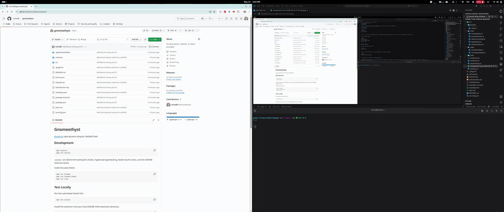

# Gnomeethyst

[Amethyst](https://github.com/ianyh/amethyst)-style dynamic tiling for GNOME Shell.

## Demo



## Development

```bash
npm install
npm run verify
```

`verify` runs Biome formatting/lint checks, TypeScript typechecking, Node's built-in tests, and the GNOME extension build.

Useful focused checks:

```bash
npm run format
npm run format:check
npm run lint
```

## Test Locally

Run the automated checks first:

```bash
npm run verify
```

Install the extension into your local GNOME Shell extensions directory:

```bash
npm run install:extension
```

The extension is installed as `gnomeethyst@local`.

On GNOME Shell 50 Wayland, a newly installed local extension may not appear in `gnome-extensions list` until you log out and back in. After the shell sees it:

```bash
gnome-extensions enable gnomeethyst@local
gnome-extensions info gnomeethyst@local
```

For later code changes, reinstall and reload the extension:

```bash
npm run install:extension
gnome-extensions disable gnomeethyst@local
gnome-extensions enable gnomeethyst@local
```

Watch GNOME Shell logs while testing:

```bash
journalctl --follow /usr/bin/gnome-shell
```

Manual smoke test:

- open 2-4 normal app windows, such as terminal windows
- use `Control+Alt+a`, `Control+Alt+s`, `Control+Alt+d`, and `Control+Alt+f` to switch layouts
- use `Control+Alt+j/k` to move focus through the managed windows
- use `Control+Alt+Shift+j/k` to swap windows
- use `Control+Alt+t` to float or unfloat the focused window
- right-click the panel indicator and try `Toggle Tiling`, `Reflow Windows`, and `Disable Gnomeethyst`

If `gnome-extensions disable gnomeethyst@local` marks the extension disabled but the panel indicator stays visible, check the Shell log for an enable/disable error. During development, a failed `enable()` can leave stale UI in the running GNOME Shell process. On Wayland, log out and back in to clear that stale state, then reinstall and enable again.

## Dependency Policy

Gnomeethyst has no runtime npm dependencies. Dev dependencies are limited to TypeScript, esbuild, Biome, and GNOME/GJS type definitions.
